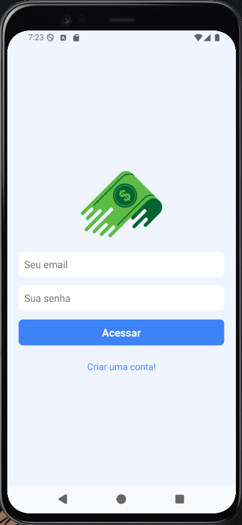
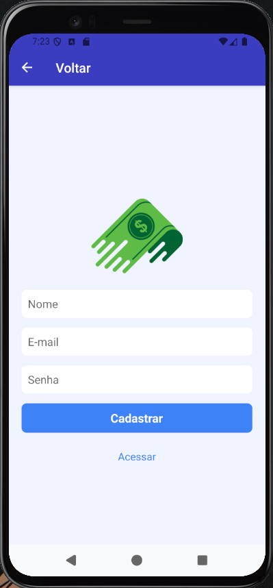
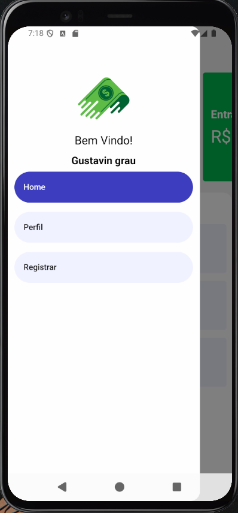
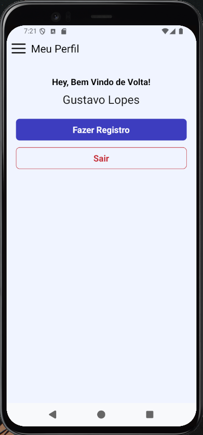
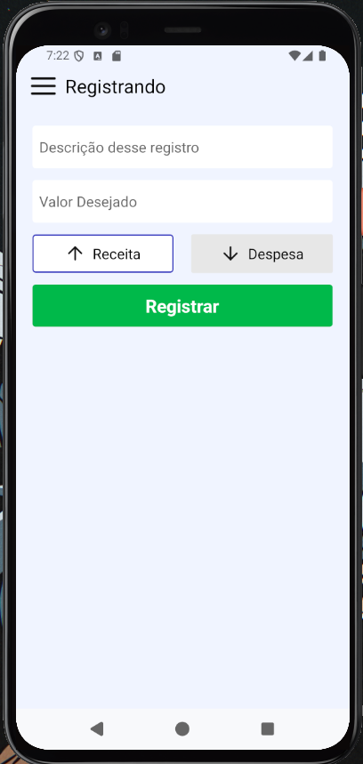

# 📱 AppFinancias

Aplicativo mobile de controle financeiro pessoal desenvolvido com React Native.  
Projeto desenvolvido durante o curso de Desenvolvimento Mobile do [Sujeito Programador](https://www.youtube.com/c/SujeitoProgramador).  
Permite visualizar, cadastrar e acompanhar entradas e saídas financeiras de forma prática e visual.

---

## 🧠 Funcionalidades

- ✅ Cadastro de entradas e saídas financeiras
- 📆 Integração com calendário para organizar lançamentos
- 📊 Tela inicial com resumo de saldo, entradas e saídas
- 🔍 Filtros por data
- 💾 Armazenamento local via SQLite
- 🎨 Interface moderna com Styled Components
- 📱 Desenvolvido para rodar no Android Studio (emulador)

---

## 📷 Telas do app:

<p align="center">
  
  
  
  
  
  
</p>

---

## 🚀 Tecnologias Utilizadas

<div style="display: flex; gap: 10px; flex-wrap: wrap;">
  
  
  
  
  
  
  
  
  
</div>

---

## 📦 Bibliotecas Utilizadas

- [react](https://reactjs.org/)
- [react-native](https://reactnative.dev/)
- [axios](https://axios-http.com/)
- [styled-components](https://styled-components.com/)
- [react-navigation](https://reactnavigation.org/)
- [react-native-calendars](https://github.com/wix/react-native-calendars)
- [react-native-vector-icons](https://github.com/oblador/react-native-vector-icons)
- [date-fns](https://date-fns.org/)
- [@react-native-async-storage/async-storage](https://github.com/react-native-async-storage/async-storage)
- [react-native-gesture-handler](https://docs.swmansion.com/react-native-gesture-handler/)
- [react-native-reanimated](https://docs.swmansion.com/react-native-reanimated/)
- [react-native-screens](https://github.com/software-mansion/react-native-screens)

---

## 🧪 Instalação e Execução

### ✅ Pré-requisitos

- [Node.js (v18+)](https://nodejs.org/)
- [Yarn](https://classic.yarnpkg.com/) ou npm
- [Git](https://git-scm.com/)
- [Android Studio](https://developer.android.com/studio) com emulador configurado
- [JDK 11+](https://www.oracle.com/java/technologies/javase/jdk11-archive-downloads.html)
- [React Native CLI](https://reactnative.dev/docs/environment-setup) (modo CLI, **não Expo**)

> ℹ️ Este projeto **não usa Expo**, é feito com React Native CLI.

## ⚙️ Configurando o Android

Abra o Android Studio e inicie um emulador Android.

Verifique se o dispositivo está conectado corretamente:

````bash
npx react-native doctor
---

## ▶️ Executando o app
Com emulador Android ativo:

Com emulador Android ativo:
npx react-native run-android

Se necessário, inicie o Metro bundler separadamente:
npx react-native start

## ▶️ Executando o app
Teste requisições com o Insomnia

Visualize o banco de dados local com o Beekeeper Studio (SQLite)

### 📥 Clonando o projeto

```bash
git clone https://github.com/GustavoLopesDev/AppFinancias.git
cd AppFinancias
````
